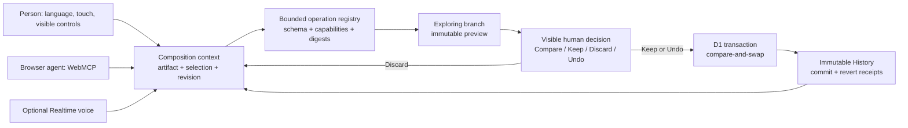

# Architecture



## Core layers

| Layer | Responsibility |
| --- | --- |
| Composition document | Stores the artifact as stable frames and semantic nodes rather than opaque pixels. |
| Design contract | Carries audience, objective, character, palette, preservation rules, exclusions, and valid operations. |
| Selection model | Gives language and agents an exact referent inside the active frame. |
| Operation registry | Normalizes and validates bounded document, frame, node, and contract changes. |
| Exploring branch | Applies proposals immutably without advancing the kept revision. |
| WebMCP surface | Exposes compact context, draft creation, previews, and human-confirmation requests. |
| Transaction API | Revalidates operations against authoritative state and commits through D1 compare-and-swap. |
| History | Stores exact before/after snapshots, operation digests, receipts, and revert revisions. |

## Authority boundary

Read and preview operations may happen through WebMCP. Consequential operations remain visible and person-owned:

```text
Agent proposal -> Exploring draft -> visible review -> person chooses consequence
```

`keep_composition_draft`, `discard_composition_draft`, and `undo_composition_change` therefore return confirmation requests. They do not silently modify durable state.

## Persistence and recovery

Keep binds the draft to the current authoritative revision. The server reconstructs and validates the operation sequence, checks postconditions, and commits the project update plus History in one D1 batch. A stale revision loses explicitly.

Undo targets the latest eligible committed change and creates a new revert revision. History remains append-only, so the applied change and its recovery are both inspectable after reload.

## Security posture

- Application content is treated as untrusted input.
- Schemas reject unknown fields and bound identifiers, labels, geometry, style values, operation counts, and receipts.
- Client-supplied operations are never accepted as durable authority.
- Platform-authenticated ChatGPT identity takes precedence; direct browser visitors receive isolated opaque first-party sessions whose values are never exposed to page JavaScript.
- Model routes authenticate and validate bounded input before reserving budget.
- API responses are private and non-cacheable.
- Framing is restricted and every document opts into an origin-keyed agent cluster.
- Realtime and recorded transcription are production-default-off.
