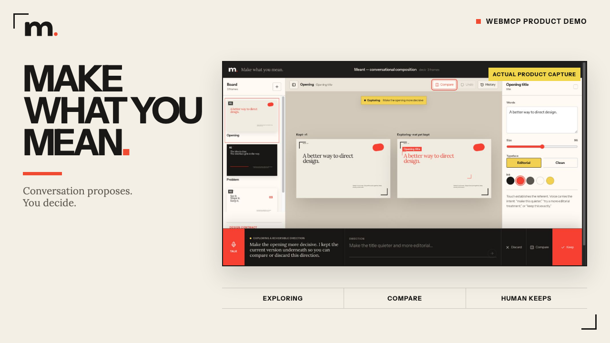

# Meant

**Meant is a conversational creative editor where people direct outcomes in ordinary language, agents work through the same semantic canvas and tools, and every consequential change stays human-controlled.**

Creative direction begins as meaning: make the title quieter, give the page more room, or make the story feel more grounded. Conventional creative software asks people to translate that intention into layers, coordinates, panels, and property names before they can evaluate the result.

Meant lets a person shape real artifacts conversationally without turning the product into a chatbot. The canvas remains central; conversation directs it. Agents inspect the same semantic document, propose reversible directions on an Exploring branch, and leave consequential decisions under explicit human control.



## The outcome

A directed creative session provides:

- a structured composition document (decks, posters, infographics) rendered directly in the editor, rather than opaque pixel screenshots;
- an explicit **Exploring** branch for cumulative, non-destructive refinement;
- side-by-side **Compare** between the kept artifact and temporary directions;
- person-owned **Keep** and **Discard** decisions backed by D1 compare-and-swap persistence;
- non-destructive **Undo** that creates a newer revert revision while preserving complete provenance in **History**;
- seven registered **WebMCP** tools allowing browser agents to inspect context, compile plain-language intent, and preview bounded operations through the same semantic rules.

## How it works

```text
Ordinary-language direction (or touch / WebMCP)
        ↓
Bounded operation compiler & schema validation
        ↓
Exploring branch preview (immutable)
        ↓
Side-by-side Compare
        ↓
Visible human decision (Keep / Discard)
        ↓
D1 compare-and-swap transaction & immutable History
```

The editor coordinates canvas state, draft exploration, and persistence asynchronously.

The production stack uses:

- **Cloudflare Workers** and **Cloudflare Pages** for edge hosting and runtime;
- **Cloudflare D1** for transactional compare-and-swap persistence and append-only revision history;
- **WebMCP** (registered on `document.modelContext`) for browser-agent tool discovery and execution;
- **React 19**, **Vite**, and **Tailwind CSS** for the responsive creative studio;
- **TypeScript** and **Zod** for strict schema validation across all tool and operation boundaries;
- **SQLite** as a local persistence fallback.

See [ARCHITECTURE.md](ARCHITECTURE.md) for the component model, operation registry, persistence guarantees, and security posture.

## WebMCP tools

Meant registers seven bounded tools on `document.modelContext`:

| Tool | Outcome |
| --- | --- |
| `get_composition_context` | Reads the active composition, selection, current revision, Exploring draft, and recent history. |
| `create_composition_draft` | Starts a deck, poster, or infographic as a reversible Exploring proposal. |
| `preview_composition_turn` | Compiles an ordinary-language direction into bounded semantic operations. |
| `preview_composition_change` | Previews exact validated operations without committing history. |
| `keep_composition_draft` | Requests human confirmation for the visible Keep decision; never commits autonomously. |
| `discard_composition_draft` | Requests human confirmation before dropping the Exploring branch. |
| `undo_composition_change` | Requests human confirmation for an exact revision-bound revert. |

The page tools and visible interface share one operation registry and one transaction path. An agent cannot bypass selection, schema validation, revision checks, Keep, or History.

## Trust boundary

- **Semantic structure over opaque pixels**: The canvas contains structured frames, layout modes, and semantic nodes rather than generated images.
- **Separate exploration from consequence**: Proposals apply immutably to an Exploring branch. The durable revision does not advance until the person chooses Keep.
- **Human-in-the-loop authority**: WebMCP tools can inspect and propose, but consequential actions (Keep, Discard, Undo) return confirmation requests; only visible person-owned controls perform them.
- **Revision-bound persistence**: D1 transactions use compare-and-swap concurrency checks to prevent stale overwrites and race conditions.
- **Undo as history**: Undo appends a newer revert revision rather than destructively erasing history, keeping both events inspectable after reload.
- **Session isolation**: Direct browser visitors receive separate high-entropy, `HttpOnly`, `Secure`, same-site sessions so work remains isolated without shared credentials.
- **Deterministic core**: The complete editor, WebMCP surface, and transaction loop operate deterministically without requiring third-party model credentials.

The public walkthrough demonstrates the complete workflow without external model dependencies. See [docs/walkthrough.md](docs/walkthrough.md) for a step-by-step guide.

## Local setup

### Requirements

- Node.js 22.13+
- npm

### Install and run

```bash
git clone https://github.com/shifujosh/meant-webmcp.git
cd meant-webmcp

npm ci
npm run db:local:init
cp .env.example .env.local
npm run dev
```

Open the local URL printed by Vite. The deterministic editor, WebMCP registration, and local D1 Keep/Undo loop work fully offline without an API key.

Set `OPENAI_API_KEY` in `.env.local` for optional model-backed compilation. Never commit `.env.local` or put credentials in URLs, screenshots, logs, or recordings.

## Tests

```bash
npm run typecheck
npm run lint
npm test
```

The public suite covers composition schema validation, operation compilation, Exploring branch immutability, revision-bound D1 transactions, undo-revert history, concurrency conflict recovery, session isolation, and the seven WebMCP tool contracts.

## Cloudflare deployment

Build and deploy to Cloudflare Workers with a dedicated D1 database:

```bash
npm run build
npx wrangler deploy --config wrangler.production.jsonc
```

The deployment script configures Cloudflare Workers, D1 persistence, and production security headers. Initialize the database schema with `scripts/init-local-db.sql` before running production migrations.

## How it was made

Meant was built to explore how creative software changes when agents and people share the same semantic canvas and authority boundaries. The concise [creation story](HOW_IT_WAS_MADE.md) documents the architectural evolution, the WebMCP integration, the design intelligence engine, and the production workflow.

## Documentation and media

- Live product: [meant.protoperfect.io](https://meant.protoperfect.io/)
- Product film: [YouTube](https://youtu.be/gMgNfCyZ7oE)
- Case study: [Protoperfect Labs](https://protoperfect.io/research/meant-intention-made-editable)
- Launch thread: [Protoperfect on X](https://x.com/protoperfect/status/2095284116031742293)
- Product and WebMCP walkthrough: [docs/walkthrough.md](docs/walkthrough.md)
- Architecture details: [ARCHITECTURE.md](ARCHITECTURE.md)
- Media assets: [`media/`](media/)

## License

Meant is available under the [MIT License](LICENSE).
