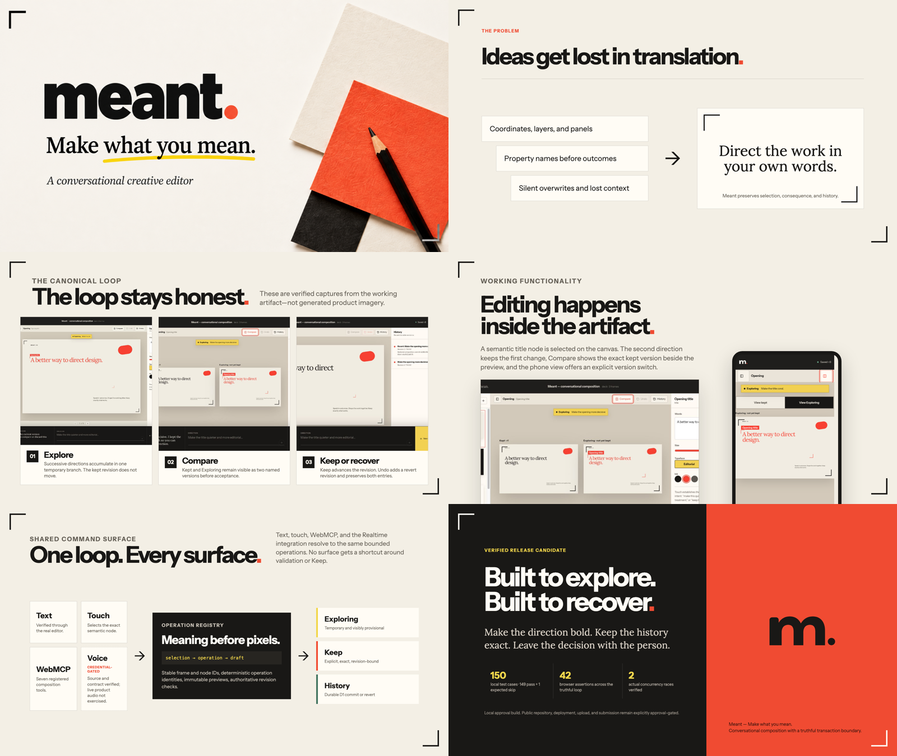

# Meant

**Make what you mean.**

Meant is a conversational creative editor where people direct outcomes in ordinary language, agents work through the same semantic canvas and tools, and every consequential change stays visible, reversible, and human-controlled.


## Submission links

- Live product: [meant.protoperfect.io](https://meant.protoperfect.io/)
- Product film: [YouTube](https://youtu.be/gMgNfCyZ7oE)
- Devpost: pending final submission approval
- Protoperfect Labs case study: drafted; publication follows final approval
- Build story: [HOW_WE_MADE_IT.md](HOW_WE_MADE_IT.md)
- Judge walkthrough: [JUDGE_GUIDE.md](JUDGE_GUIDE.md)
- Architecture: [ARCHITECTURE.md](ARCHITECTURE.md)
- Hackathon change log: [HACKATHON_BUILD_LOG.md](HACKATHON_BUILD_LOG.md)

This repository is the clean, runnable public submission snapshot. Ongoing product development and private release operations remain in separate working repositories.

## The problem

Creative direction starts as meaning: make the title quieter, give the page more room, or make the story feel more grounded. Conventional creative software asks people to translate that intent into layers, coordinates, panels, and property names before they can judge the result.

Agents remove some of that translation burden only when they understand more than pixels. They need the same semantic canvas, active selection, valid operations, draft state, revision, and recovery tools that the person uses. Otherwise, they work through layers of abstraction that produce generic or incorrect results.

Meant lets a person shape the real artifact conversationally without turning the product into a chatbot. The canvas stays central. Conversation directs it.

## The product loop

1. **Say it.** Start a deck, poster, or infographic with an ordinary-language brief.
2. **See it.** Meant renders a structured artifact inside the editor.
3. **Shape it.** Refine a selected title, frame, or object through language, touch, or a browser agent.
4. **Compare it.** Inspect the kept artifact beside the temporary Exploring direction.
5. **Keep or discard it.** Only the visible person-owned controls create consequence.
6. **Change your mind.** Undo creates a newer revert revision while History preserves both events.

Every proposal begins as **Exploring**. The kept revision does not advance until the person chooses **Keep**. **Discard** removes only the temporary direction. **Undo** restores the prior artifact without deleting provenance.

## Why WebMCP

Meant registers seven tools on `document.modelContext`:

| Tool | Outcome |
| --- | --- |
| `get_composition_context` | Reads the active composition, selection, current revision, Exploring draft, and recent history. |
| `create_composition_draft` | Starts a deck, poster, or infographic as a reversible Exploring proposal. |
| `preview_composition_turn` | Compiles one ordinary-language direction into bounded semantic operations. |
| `preview_composition_change` | Previews exact validated operations without committing history. |
| `keep_composition_draft` | Requests the visible human Keep decision; it never commits by itself. |
| `discard_composition_draft` | Requests visible human confirmation before dropping the Exploring branch. |
| `undo_composition_change` | Requests visible human confirmation for one exact revision-bound revert. |

The page tools and visible interface share one operation registry and one transaction path. An agent cannot bypass selection, schema validation, revision checks, Keep, or History.

## What is real in this submission

- The canvas contains a structured composition document, not a generated screenshot.
- Exploring, cumulative refinement, Compare, Keep, Discard, reload persistence, Undo, and History operate on the real artifact.
- Keep uses D1 compare-and-swap persistence and immutable history.
- Undo adds a revert revision and retains the original change.
- WebMCP tools inspect and preview through the same bounded operations as text and visible controls.
- Agent-side Keep, Discard, and Undo return confirmation requests; the visible person-owned controls perform the action.
- ChatGPT-hosted requests use platform identity. Direct browser visitors receive separate high-entropy, `HttpOnly`, `Secure`, same-site sessions so durable work remains isolated without a shared demo credential.
- The product film uses verified captures from the working application whenever functioning product behavior is shown.

Realtime voice integration is present but production-default-off. The complete judged path uses text, visible controls, and WebMCP and does not require a product-audio round trip.

## Local setup

Requirements: Node.js 22.13 or later and npm.

```bash
git clone https://github.com/shifujosh/meant-webmcp.git
cd meant-webmcp
npm ci
npm run db:local:init
cp .env.example .env.local
npm run dev
```

Open the URL printed by Vite. The deterministic editor, WebMCP registration, and local D1 Keep/Undo loop work without an API key.

Optional model-backed services require `OPENAI_API_KEY` in `.env.local`. Realtime voice additionally requires `MEANT_ENABLE_REALTIME_VOICE=true`; leave it disabled unless provider-side spend limits and monitoring are configured.

The hosted release uses [`wrangler.production.jsonc`](wrangler.production.jsonc), a dedicated Cloudflare Worker, and a dedicated D1 database. Build with `npm run build`, initialize the D1 schema from `scripts/init-local-db.sql`, and deploy with `npx wrangler deploy --config wrangler.production.jsonc` from an authenticated Cloudflare environment.

## Verification

```bash
npm run typecheck
npm run lint
npm test
npm audit
```

The public snapshot passed:

- production build and TypeScript;
- 152 automated cases, 152 passed;
- lint and diff checks;
- zero known npm advisories across production and development dependencies;
- 3/3 isolated D1 model-admission checks; and
- a real-browser/D1 product walkthrough with 42 assertions, two actual concurrency races, desktop, 390×844 mobile, and 768×844 touch verification.

The full hosted product-loop verification confirmed durable Keep, reload, Discard, History, revisioned Undo, security headers, closed production test routes, and a clean browser console. The active custom-domain release is Cloudflare Worker version `0c362357-5481-48bd-a110-85bae0b8b91f`; `https://meant.protoperfect.io/` was then independently rechecked for HTTPS, hardened session cookies, closed production test routes, all seven WebMCP tools, correct rendering, and a clean browser console.

## Media

- Final product film, captions, and thumbnail: [`media/demo/`](media/demo/)
- Verified product-loop clips: [`media/product/`](media/product/)
- Six-slide product and submission deck: [`media/deck/`](media/deck/)



## License

[MIT](LICENSE) © 2026 Joshua Lora.
